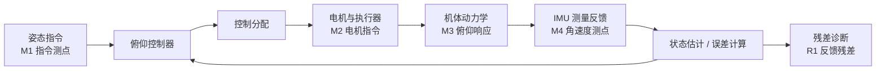

# 多信号流图测点与中文链路语义设计

## 背景

当前故障平台允许导入完整飞控系统、注入故障、运行仿真并观察结果。系统内部仍然需要使用 Python 变量名、模块 id、信号 id、CAN 报文 id 等英文或工程化标识；但最终成品面向中文用户，多信号流图和故障注入展示不应把这些内部标识作为主要界面语言。

本设计采用“测点优先”的多信号流图方向：图的主要对象不是裸节点和裸连线，而是中文信号链路、测点、故障传播状态和诊断残差。英文变量名作为内部映射保留在详情层，用于调试、导出和 Python 代码绑定。

## 目标

1. 多信号流图以中文链路表达飞控系统信号流，例如“姿态指令 -> 姿态控制器 -> 电机指令 -> 机体响应 -> IMU 测量 -> 状态估计 -> 残差诊断”。
2. 引入测点概念，测点作为可观测锚点展示当前值、残差、单位、采样率、关联故障和传播状态。
3. 区分能沿连线传播的故障和不能作为故障载荷沿线传播的本地/参数故障。
4. 属性面板继续保留内部英文变量、Python 函数和 CAN 元数据，但默认展示中文名称、中文解释和中文诊断结论。
5. 支持未来建模流程：先用英文变量/Python 模块搭系统，再通过中文语义包装层呈现给用户。

## 非目标

本阶段不重写仿真数值算法，不要求自动推导所有物理因果关系，不把英文变量从内部数据结构中删除。英文标识仍然是模型导入、Python 绑定、保存和回放的稳定键。

## 核心概念

### 中文语义包装层

每个节点、端口、连线、信号通道和故障绑定都可以拥有一组显示字段：

- `displayNameZh`：中文显示名，例如“俯仰角速度测量”。
- `descriptionZh`：中文解释，例如“IMU 输出的俯仰角速度反馈信号”。
- `signalPathZh`：链路名，例如“IMU 测量反馈链路”。
- `measurementLabelZh`：测点名，例如“测点 M3：IMU 反馈”。
- `engineeringKey`：内部英文变量或 id，例如 `imu.pitch_rate`。
- `pythonVariable`：Python 变量名，例如 `measured_rate`。
- `unitZh`：中文单位说明，例如“度/秒”。

界面显示顺序为：中文名称优先，必要时在详情小字中显示英文键。列表、图节点、测点徽标和边标签默认不直接显示英文变量。

### 测点 Measurement Point

测点是多信号流图中的一等对象。测点可以绑定到四类位置：

- 节点输出：控制器输出、电机推力、传感器测量值。
- 连线中段：CAN 报文、普通信号流、命令链路。
- 仪器输入：示波器、记录仪、频谱仪、多信号流图仪器。
- 残差节点：正常分支与故障分支的差值或诊断指标。

测点字段：

- `id`：稳定 id，例如 `mp-imu-feedback`。
- `labelZh`：中文测点名。
- `bindTarget`：`nodeOutput | edge | instrumentInput | residual`。
- `nodeId` / `edgeId` / `portIndex`：绑定对象。
- `signalId`：内部信号 id。
- `signalNameZh`：中文信号名。
- `unit`：工程单位。
- `sampleRate`：采样率。
- `role`：`command | control | actuation | plant | measurement | estimate | residual | protocol`。
- `currentValue`：仿真后的当前值。
- `residualValue`：残差值。
- `faultInfluence`：`none | localEffect | propagated | blocked | diagnosticOnly`。

### 故障传播分类

故障不再只用“红色”表示，而要表达传播语义。

传播型故障：

- 传感器加性偏置、比例失真、噪声增强、有色噪声、信号冻结、状态跳变或符号翻转。
- 执行器卡死或失效、饱和限制对执行链输出的影响。
- 协议层固定延迟、时变延迟、随机丢包、突发丢包、数据篡改、阻塞或中断。

这类故障会改变下游信号值、时序、有效性或报文载荷。多信号流图中应沿下游边和受影响测点显示传播状态。

本地/参数型故障：

- 质量、惯量、阻力、控制增益、分配矩阵、最大推力、模型参数偏置/渐变/突变。

这类故障主要改变模块内部模型参数，不作为“故障载荷”沿连线传递。它们应显示为模块本地故障标记，并通过模块输出测点和残差测点体现影响。

诊断型影响：

- 残差、估计误差、频谱能量、告警状态。

诊断型影响不是被控对象信号本身的故障传播，而是观察故障后果的指标。图上应使用橙色/诊断样式，而不是等同于故障传播边。

### 边的语义

连线不仅表示连接，还要表达：

- 中文链路名。
- 传递的信号通道列表。
- CAN/协议元数据。
- 所在链路阶段。
- 故障传播策略：`inherit | propagates | localOnly | blocks | diagnosticOnly`。
- 受影响测点列表。
- 运行态指标：延迟、丢包率、突发长度、当前值、残差。

## 图形呈现

### 主视图结构

多信号流图采用横向链路结构：

1. 指令与参考：姿态指令、高度指令、目标轨迹。
2. 控制与分配：控制器、控制分配、电机指令。
3. 执行与机体：执行器、电机、机体动力学。
4. 测量与估计：IMU、气压计、GPS、状态估计器。
5. 诊断与残差：残差生成、阈值判断、仪器输出。

每个阶段内部显示中文模块名。模块之间的主线显示中文链路名。测点以 `M1/M2/...` 徽标挂在边或节点输出附近。

### 颜色和线型

- 蓝色实线：正常信号链路。
- 红色实线或高亮边：传播型故障正在影响下游信号。
- 红色节点角标：本地/参数故障，仅标记模块，不把后续边全部染红。
- 紫色虚线：协议/CAN 链路，显示延迟、丢包、报文 id。
- 橙色线或测点：残差/诊断指标。
- 灰色截断线：传播被阻断或链路中断。

### 测点卡片

选中测点时，右侧属性面板显示：

- 中文测点名和所在链路。
- 绑定对象：模块输出/连线/仪器输入/残差。
- 当前值、参考值、残差、单位。
- 受哪些故障影响。
- 影响类型：传播型、本地影响、诊断指标、阻断。
- 内部映射：英文 signalId、Python variable、CAN channel/message。

### 故障图例

图例不只解释颜色，还解释故障传播含义：

- “传播”：故障进入信号载荷或时序，影响下游测点。
- “本地”：故障改变模块内部参数，下游只看到输出后果。
- “阻断”：链路中断或报文丢失，下游收到保持值、零值或无效值。
- “诊断”：不是原始信号传播，而是残差/告警结果。

## 属性面板调整

### 连线属性

默认中文摘要：

- 链路名称：IMU 反馈链路。
- 源：机体动力学输出。
- 目标：状态估计器输入。
- 主信号：俯仰角速度测量。
- 故障传播：可传播/本地/阻断/诊断。

高级映射区保留：

- `signalId`
- `channelId`
- `messageId`
- `pythonVariable`
- `payloadKind`
- `faultPropagationPolicy`

### 节点属性

节点属性面板按类型显示中文角色：

- 信号源：指令/参考输入。
- 仿真块：控制、分配、执行、机体、传感器、估计。
- 故障块：本地参数故障或传播故障。
- 仪器：测点、波形、日志、频谱、残差。

### 故障设置

故障设置中增加“传播语义”区：

- 故障类型中文名。
- 是否沿信号传播。
- 影响哪些测点。
- 是否改变协议时序/报文载荷。
- 是否只改变模块内部参数。

## 故障类型默认传播语义

| 故障类型 | 默认传播语义 | 图上表达 |
|---|---|---|
| 物理层参数偏置/渐变/突变 | `localOnly` | 节点红角标，输出测点和残差变色 |
| 执行器卡死或失效 | `propagates` | 执行链输出边红色，后续机体响应测点受影响 |
| 饱和限制 | `localEffect` | 执行/控制模块角标，饱和测点提示 |
| 传感器偏置/比例/噪声/冻结 | `propagates` | 测量链路红色，估计器输入测点受影响 |
| 状态跳变或符号翻转 | `propagates` | 反馈链路红色，控制误差测点高亮 |
| 间歇异常 | `propagates` | 受影响边按触发窗口高亮，日志记录 |
| 固定/时变延迟 | `propagates` | 协议边紫色虚线加延迟标识 |
| 随机/突发丢包 | `blocks` | 协议边灰/红间断，显示丢包率和突发长度 |
| 数据篡改 | `propagates` | 协议边红紫高亮，显示原始/篡改差值 |
| 阻塞或中断 | `blocks` | 链路断开样式，下游测点显示保持/无效 |

## 示例中文链路

闭环俯仰控制演示模型应显示为：

内部仍可映射到：

- `pitch_command`
- `controller_output`
- `motor_command`
- `body_pitch_rate`
- `imu.pitch_rate`
- `pitch_rate_residual`

## 测试与验收

新增或更新测试应覆盖：

1. 多信号流图展示中文链路名和测点名，而不是只展示英文 signalId。
2. `collectDataflowEdges` 或新增语义收集函数能返回测点、传播策略、受影响测点。
3. 传播型故障会标记下游受影响测点。
4. 本地/参数型故障不会把所有下游边都染成传播故障，但会影响输出测点/残差测点。
5. 连线属性面板默认显示中文摘要，高级区保留英文变量和 CAN 元数据。
6. 示例飞控模型导入后，多信号流图至少包含指令、控制、执行、机体、测量、估计、残差七类中文链路。

## 实施边界

第一阶段只做语义包装和展示，不改仿真核心。已有模型包可以逐步补 `displayNameZh`、`signalPathZh` 和测点配置；缺失时用规则从节点类型、端口名和 fault catalog 推导中文显示名。

实现时应优先新增小型语义函数，而不是继续把所有逻辑堆进渲染函数。建议新增：

- `buildChineseSignalLabel`
- `collectMeasurementPoints`
- `classifyFaultPropagation`
- `buildDataflowSemanticModel`
- `renderMeasurementFirstDataflowPanel`

这些函数可以先放在现有运行时附近，后续再拆入独立服务文件。
