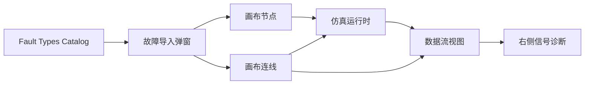
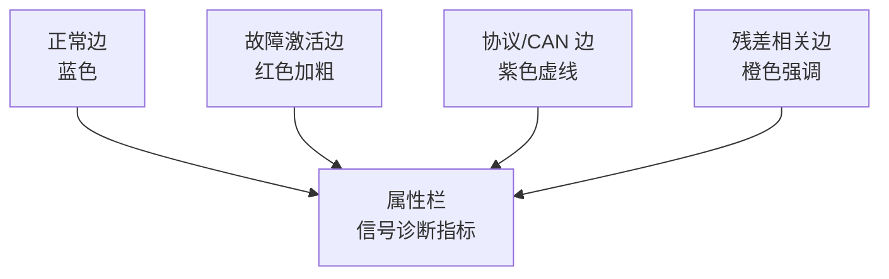

# 多信号流图嵌入方案

本文档说明如何把 Fault Types 故障库和平台内的数据流视图结合起来。目标是让平台不仅能“放置故障块”，还可以在同一张模型图里观察故障沿信号链路传播的状态。

## 设计目标

1. 故障类型库仍是源头：`fault-type-catalog.json` 负责定义故障的公式、参数、作用对象、Python 函数和展示方式。
2. 画布拓扑仍是源头：`workbenchSnapshot.modelNodes` 和 `workbenchSnapshot.modelEdges` 负责定义真实连接关系。
3. 多信号流图不复制模型，只读取当前画布边、端口和故障元数据。
4. 示波器、数据记录仪、频谱分析仪负责局部信号；多信号流图负责全局传播路径和边级指标。

## 平台嵌入位置

当前实现采用两个入口：

| 入口 | 作用 |
| --- | --- |
| 画布顶部 `数据流视图` tab | 打开全局多信号流图摘要面板，显示所有边的状态。 |
| 左侧 `多信号流图` 仪器 | 作为仪器节点放入模型，用于明确表达该模型包含全局数据流观测层。 |

## 边指标 Schema

每条画布边会被转换为一个数据流记录：

| 字段 | 来源 | 用途 |
| --- | --- | --- |
| `signalName` | 上游节点名称 + 输出端口 | 显示信号语义。 |
| `currentValue` | `SIM.actual.nodeStates[sourceNode].lastOutputs` | 显示当前采样值。 |
| `residual` | 残差或求和节点输出 | 显示正常/故障支路差异。 |
| `latency` | 协议故障参数 `delay_seconds/base_delay/jitter` | 标识延迟类协议故障。 |
| `dropRate` | 协议故障参数 `drop_rate/start_probability/loss_rate` | 标识丢包类协议故障。 |
| `burstLength` | 协议故障参数 `burst_length` | 标识突发丢包长度。 |
| `faultActive` | 边、源节点或目标节点的 `injectedFault` | 标识故障传播边。 |

## 视觉编码

显示规则：

| 状态 | 判断方式 | 平台表现 |
| --- | --- | --- |
| 正常 | 无故障、非协议、非残差 | 保持普通蓝色连线。 |
| 故障激活 | 边或相邻节点带 `injectedFault` | 数据流视图中红色加粗。 |
| 协议链路 | `lineType === "can"` 或协议故障 | 紫色虚线强调，并显示延迟/丢包。 |
| 残差观测 | 目标节点是 `sum_block` 或名称含 residual/残差 | 橙色强调，并显示残差值。 |

## 与 Fault Types 的关系

`fault-type-catalog.json` 中的每个故障类型都能落到三类展示方式之一：

| 故障层级 | 推荐承载 | 数据流图展示 |
| --- | --- | --- |
| 物理层 | 仿真块内部参数或显式故障节点 | 标红故障支路，显示当前值和残差。 |
| 电气层 | 仿真块 `injectedFault` 或传感器故障节点 | 标红测量链路，示波器看波形，数据流图看传播路径。 |
| 协议层 | CAN 边 `injectedFault` | 紫色虚线，显示延迟、丢包率、突发长度。 |

## 后续增强

1. 将 `currentValue`、`residual`、`rms`、`spectrumPeak` 统一写入运行时 edge metrics 缓存，避免只从节点状态推断。
2. 在数据流视图中支持按子系统折叠，例如“传感器链路”“协议链路”“执行器链路”。
3. 在属性栏增加边级时间窗统计：最近 5 秒均值、RMS、峰值和异常事件数。
4. 将多信号流图导出为 JSON，供报告和演示视频复用。

