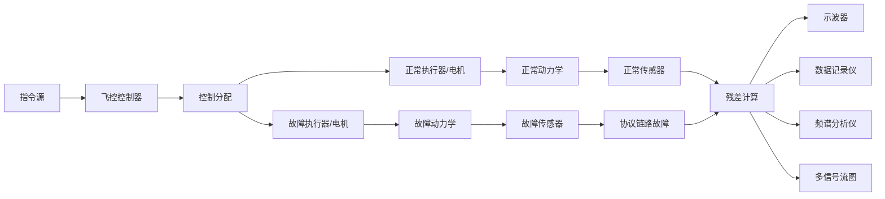
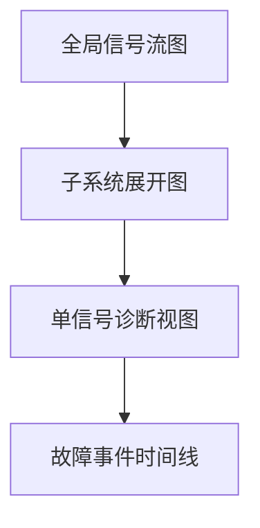

# 无人机飞控系统故障类型实现方案

本文档根据 `无人机飞控系统故障.pdf` 梳理故障类型，并把每一种故障映射到平台中的模型、节点、参数、仪器展示和 Python 实现。目标不是只列故障清单，而是形成后续可落地的完整故障注入模型。

配套文件：

- `fault-type-catalog.json`：结构化故障 catalog，可作为平台故障库的数据源。
- `uav-fault-models.py`：每类故障的 Python 实现模板。
- `full-model-blueprint.json`：完整无人机飞控故障注入大模型蓝图。

## 总体建模原则

平台应采用“正常支路 + 故障支路 + 残差观测”的统一结构。正常支路保持标称模型，故障支路在物理层、电气层或协议层插入故障。所有故障最终都通过示波器、数据记录仪、频谱分析仪和后续多信号流图展示。

完整模型建议拆成 9 个子系统，其中 8 个是飞控模型子系统，1 个是仪器观测子系统：

| 子系统 | 作用 | 主要故障入口 |
| --- | --- | --- |
| 指令与任务源 | 生成姿态、高度、速度和航迹命令 | 指令篡改、指令延迟、指令丢包 |
| 飞控控制器 | 姿态环、高度环、偏航环控制 | 控制增益异常、符号翻转、控制量间歇异常 |
| 控制分配 | 将虚拟控制量映射到各电机 | 分配矩阵错误、符号错误 |
| 执行器与电机 | 电机指令到推力/力矩 | 电机效率衰减、卡死、推力饱和、电池压降 |
| 飞行器动力学 | 计算机体姿态、速度、位置 | 质量偏差、惯量偏差、阻力突变 |
| 传感器测量链 | IMU、气压计、GPS、姿态角测量 | 偏置、比例失真、噪声、冻结、跳变 |
| 协议与数据链路 | 传输控制和测量数据 | 固定延迟、时变延迟、丢包、突发丢包、篡改、中断 |
| 估计与观测 | 状态估计、残差、故障指标 | 残差阈值、状态观测、故障定位 |
| 仪器观测层 | 示波器、日志、频谱、多信号流图 | 不注入故障，只显示故障传播和运行指标 |

## 当前平台能力与需要补齐的模块

当前平台已有能力：

| 能力 | 当前支持情况 | 说明 |
| --- | --- | --- |
| 示波器 | 已支持 | 双通道波形，可对比正常和故障响应。 |
| 数据记录仪 | 已支持 | 已能记录残差、显示采样表和导出 CSV。 |
| 频谱分析仪 | 已支持 | 已能对残差信号做频谱条形展示。 |
| Python 绑定仿真块 | 已支持 | 适合作为复杂故障模型和完整子系统实现入口。 |
| `fault_bias` | 部分支持 | 可以表达简单加性偏置，但缺少单位、轴向、时间窗配置。 |
| `fault_noise` | 部分支持 | 可以表达简单随机噪声，但需要扩展为高斯/白噪声/有色噪声/脉冲噪声。 |
| `fault_stuck` | 部分支持 | 组件库中有定义，但运行参数和左侧入口需要统一。 |
| `fault_drift` | 部分支持 | 组件库中有定义，但需要明确 drift rate、起始时间和持续时间。 |
| 协议边故障 | 部分支持 | 已有 delay/loss/bitflip/replay 类行为，需要扩展为定量配置。 |

建议新增或强化的模块：

| 新模块 | 对应故障 | 输入/输出 | 关键参数 |
| --- | --- | --- | --- |
| `fault_parameter_bias` | 物理层参数偏置、传感器偏置 | scalar -> scalar | `offset`, `scale`, `target_parameter`, `start`, `duration` |
| `fault_gain_scale` | 比例失真、效率下降 | scalar -> scalar | `scale`, `axis`, `start` |
| `fault_drift_ramp` | 渐变故障 | scalar -> scalar | `rate`, `rise_time`, `max_delta`, `start` |
| `fault_step_jump` | 突变、状态跳变 | scalar -> scalar | `step_value`, `start`, `mode` |
| `fault_saturation` | 推力/油门上限降低 | scalar -> scalar | `lower`, `upper`, `start` |
| `fault_freeze_hold` | GPS 冻结、信号阻塞 | scalar -> scalar | `hold_strategy`, `start`, `duration` |
| `fault_noise_configurable` | 高斯、白噪声、脉冲噪声 | scalar -> scalar | `noise_type`, `std`, `amplitude`, `probability`, `seed` |
| `fault_colored_noise` | 有色噪声 | scalar -> scalar | `alpha`, `std`, `seed` |
| `fault_intermittent_gate` | 间歇异常 | scalar -> scalar | `period`, `duty`, `inner_fault_type` |
| `fault_delay_buffer` | 固定延迟 | scalar -> scalar | `delay_seconds`, `delay_steps` |
| `fault_jitter_delay` | 时变延迟 | scalar -> scalar | `base_delay`, `jitter`, `distribution` |
| `fault_packet_loss` | 随机丢包 | scalar -> scalar | `drop_rate`, `strategy` |
| `fault_burst_loss` | 突发丢包 | scalar -> scalar | `burst_length`, `start_probability` |
| `fault_payload_tamper` | 数据篡改 | scalar -> scalar | `bias`, `scale`, `invert`, `bitflip_mask` |
| `fault_link_interrupt` | 阻塞/中断 | scalar -> scalar | `strategy`, `start`, `duration` |
| `instrument_multi_signal_flow` | 多信号流图 | multi-input -> visual metrics | `signals`, `aggregation`, `edge_metric` |

## 故障类型定量描述

### 物理层故障

| 故障类型 | 定量模型 | 参数改变 | 平台实现 | 观测方式 |
| --- | --- | --- | --- | --- |
| 参数偏置 | `p_f = p_0 + delta_p` 或 `p_f = k p_0` | `UAV_Mass`, `Ixx`, `Iyy`, `Izz`, `Cd`, 控制增益 | `fault_parameter_bias` 或仿真块 `injectedFault` | 姿态误差、高度误差、残差 |
| 参数渐变 | `p_f(t)=p_0 + rate * max(t-t0,0)` | `Motor_Efficiency_All`, `Battery_Voltage`, `Baro_Bias` | `fault_drift_ramp` | 残差趋势、爬升性能下降 |
| 参数突变 | `p_f(t)=p_0 + step * I(t>=t0)` | `Motor_Max_Thrust`, `Alloc_Matrix`, `Cd` | `fault_step_jump` | 突变时刻前后波形对比 |
| 执行器卡死/失效 | `u_f(t)=lock_value` | `Motor_i_Lock_Value`, 舵机输出、油门输出 | `fault_freeze_or_lock` | 电机指令与实际推力差值 |
| 饱和限制 | `u_f=clamp(u, lower, upper_fault)` | `Throttle_UpperLimit`, `Motor_Max_Thrust` | `fault_saturation` | 控制量饱和率、推力裕度 |

物理层实现建议：

- 参数类故障优先作为仿真块内部参数修改，因为它改变模型结构或参数，而不是单纯改变信号。
- 执行器卡死、饱和限制适合做成显式故障节点，插在控制分配和电机模型之间。
- 电池压降既可以作为物理层参数渐变，也可以作为电机模型输入信号的一条独立支路。

### 电气层故障

| 故障类型 | 定量模型 | 参数改变 | 平台实现 | 观测方式 |
| --- | --- | --- | --- | --- |
| 加性偏置 | `y_f = y + b` | `Gyro_Bias_Z`, `Baro_Bias`, `GPS_Pos_Bias` | `fault_sensor_bias` | 传感器输出、估计残差 |
| 比例失真 | `y_f = scale * y` | `Accel_Scale_Z`, 姿态测量比例 | `fault_gain_scale` | 幅值变化、估计误差 |
| 噪声增强 | `y_f = y + n(t)` | `Gyro_Noise_STD`, `Baro_Noise_STD` | `fault_noise_configurable` | RMS 噪声、频谱能量 |
| 有色噪声 | `n[k]=alpha n[k-1]+e[k]` | 低频相关噪声参数 | `fault_colored_noise` | 频谱低频能量抬升 |
| 信号冻结 | `y_f[k]=y_f[k-1]` | `GPS_Pos_Freeze_Enable`, `GPS_Vel_Freeze_Enable` | `fault_freeze_hold` | 轨迹失真、速度冻结 |
| 状态跳变 | `y_f = y + jump` | 姿态角、角速度、状态量 | `fault_state_jump` | 跳变瞬间控制误差 |
| 符号翻转 | `y_f = -y` | `Phi_Sign_Fault`, `Cmd_Sign_Tamper` | `fault_state_jump` 的 `invert` 模式 | 越控制越偏、发散 |
| 间歇异常 | 周期门控 `fault_on = phase <= duty` | 偏置、噪声、阻塞的触发门控 | `fault_intermittent_gate` | 日志触发记录、间歇残差 |

电气层实现建议：

- 传感器故障应插在真实状态和估计器之间。
- 每个传感器模块应在属性面板展示作用轴、单位、噪声参数、触发时间。
- 对 IMU、GPS、Baro 分别建立专门子系统，便于后续在多信号流图中显示每一路信号质量。

### 协议层故障

| 故障类型 | 定量模型 | 参数改变 | 平台实现 | 观测方式 |
| --- | --- | --- | --- | --- |
| 固定延迟 | `y_f[k]=y[k-d]` | `GPS_Delay`, `Gyro_Delay`, 指令链路时延 | 协议边 `delay` 或 `fault_delay_buffer` | 相位滞后、振荡 |
| 时变延迟 | `d(k)=base+jitter(k)` | `Target_Update_Delay`, 传感器更新延迟 | `fault_jitter_delay` | latency min/max、控制抖动 |
| 随机丢包 | 以 `drop_rate` 概率保持上一帧 | `GPS_Drop_Rate`, 控制数据丢包率 | 协议边 `loss` 或 `fault_packet_loss` | 丢包率、估计发散 |
| 突发丢包 | 连续 `L` 帧丢失 | `Burst_Loss_Length` | `fault_burst_loss` | packet gap、突发失控 |
| 数据篡改 | `payload_f=scale*payload+bias` 或 `-payload` | `GPS_Pos_Bias`, `Cmd_Sign_Tamper` | `fault_payload_tamper` | 原始/篡改 payload 差值 |
| 阻塞/中断 | 保持上一帧或输出零 | `Sensor_Data_Tamper_Enable`, 链路开关 | `fault_link_interrupt` | sensor age、link status |

协议层实现建议：

- 协议故障应优先作为连接线属性实现，而不是普通节点。这样更符合“传输过程故障”的语义。
- 当前 CAN 线已有 loss/delay/bitflip/replay 原型，需要扩展参数面板：丢包率、延迟秒数、突发长度、篡改策略。
- 数据流视图应显示协议边的实时状态，例如有效帧率、延迟、丢包计数、payload 差值。

## 飞控现象到故障类型的映射

| 现象 | 可能原因 | 需要展示的信号 |
| --- | --- | --- |
| 姿态偏转、缓慢漂移 | Gyro 零偏、姿态测量偏置、单旋翼推力衰减、惯量参数错误 | `phi/theta/psi`, `gyro`, `motor_thrust`, `attitude_residual` |
| 偏航慢慢转圈、Yaw 难稳定 | `Gyro_Z` 零偏、上下旋翼效率不一致、Yaw 控制增益异常 | `yaw`, `r`, `yaw_cmd`, `yaw_residual` |
| 高度下降、无法悬停 | 气压计漂移、加速度计比例失真、电机推力衰减、电池压降、质量偏大 | `altitude`, `baro`, `accel_z`, `battery_voltage`, `thrust` |
| 高度来回振荡 | 气压计噪声增强、高度控制器增益异常、高度反馈延迟 | `altitude`, `baro_noise`, `controller_output`, `delay_metric` |
| 位置估计发散、速度异常 | GPS 冻结、GPS 丢包、GPS 延迟、GPS 篡改 | `gps_position`, `gps_velocity`, `trajectory_error`, `packet_loss_rate` |
| 姿态快速振荡、控制高频波动 | Gyro 噪声增强、姿态角噪声、角速度反馈延迟、控制增益过大 | `gyro`, `attitude`, `control_output`, `spectrum_bins` |
| 大机动失败、控制量饱和 | 推力上限降低、电池电压下降、质量增大、阻力增大 | `throttle`, `thrust_margin`, `battery_voltage`, `velocity` |
| 某一轴响应方向反转 | 姿态反馈信号颠倒、分配矩阵符号错误、协议篡改 | `axis_feedback`, `control_error`, `divergence_flag` |
| 传感器间歇异常 | 间歇偏置、突发噪声、执行器命令间歇阻塞、突发丢包 | `burst_flag`, `sensor_output`, `link_status`, `event_log` |

## Python 实现组织

`uav-fault-models.py` 提供以下函数：

| 函数 | 对应故障 |
| --- | --- |
| `parameter_bias` | 参数偏置、传感器偏置 |
| `parameter_scale` | 比例失真、效率下降 |
| `parameter_drift` | 渐变故障 |
| `parameter_step` | 参数突变、状态跳变 |
| `actuator_lock` | 执行器卡死 |
| `saturation_limit` | 饱和限制 |
| `gaussian_noise`, `white_noise`, `pulse_noise`, `colored_noise` | 噪声故障 |
| `signal_freeze` | GPS 冻结、信号阻塞 |
| `state_jump`, `sign_flip` | 状态突变、符号翻转 |
| `intermittent_fault` | 间歇异常 |
| `fixed_delay`, `time_varying_delay` | 固定延迟、时变延迟 |
| `random_packet_loss`, `burst_packet_loss` | 随机丢包、突发丢包 |
| `data_tamper` | 数据篡改 |
| `blocking_interrupt` | 阻塞/中断 |
| `apply_fault_signal` | 统一调度入口 |

建议平台后续接入方式：

1. 对简单信号故障，使用显式故障节点调用 `apply_fault_signal`。
2. 对模型内部参数故障，在 Python 绑定仿真块中读取 `injectedFault` 参数并修改模型参数。
3. 对协议故障，在连接线运行时维护 `FaultRuntimeState`，即 delay queue、packet history、burst counter。
4. 对复合故障，使用 `fault_intermittent_gate` 包裹任意内部故障模型。

## 多信号流图结合方案

多信号流图不应只画拓扑，应显示每条信号的运行指标。建议每条边绑定以下 metrics：

| 指标 | 含义 | 来源 |
| --- | --- | --- |
| `current_value` | 当前信号值 | 运行时采样 |
| `residual` | 与参考支路差值 | 残差计算节点 |
| `rms` | 均方根强度 | 数据记录仪 |
| `spectrum_peak` | 频谱峰值 | 频谱分析仪 |
| `latency` | 协议延迟 | 协议边状态 |
| `drop_rate` | 丢包率 | 协议边状态 |
| `fault_active` | 故障是否激活 | 故障节点状态 |

多信号流图的展示层级：

显示规则：

- 正常边：蓝色。
- 故障激活边：红色。
- 延迟或丢包边：紫色虚线。
- 残差超阈值边：橙色加粗。
- 仪器节点：绿色。
- 鼠标悬停边时展示当前值、残差、延迟和丢包率。
- 点击边后右侧属性面板切换为“信号诊断”。

## 平台落地顺序

第一阶段建议先完成“可覆盖全部故障类型”的最小闭环：

1. 新增可配置故障节点：`fault_gain_scale`, `fault_drift_ramp`, `fault_step_jump`, `fault_saturation`, `fault_freeze_hold`。
2. 扩展 `fault_noise`：支持 Gaussian、white、colored、pulse。
3. 扩展协议边属性：支持 fixed delay、jitter delay、packet loss、burst loss、tamper、interrupt。
4. 建立完整 UAV 大模型：正常支路和故障支路并行。
5. 将 `fault-type-catalog.json` 导入为故障库。
6. 将每类故障绑定到示波器、数据记录仪、频谱分析仪。
7. 再接入多信号流图，展示全局信号质量与故障传播路径。

第二阶段再做精细化：

1. 每类故障增加单位和轴向配置。
2. 增加故障激活时间线。
3. 增加复合故障配置，例如“间歇 + 噪声增强”或“延迟 + 丢包”。
4. 增加故障指标自动判读，例如残差阈值、RMS 噪声、频谱峰值。

## 与当前 comparison demo 的关系

当前 `evtol_fault_comparison_demo.json` 已经体现了一个最小样例：

- 正常电机支路。
- 故障电机支路。
- `motor_efficiency_loss` 故障。
- 正常/故障示波器对比。
- 残差数据记录仪。
- 残差频谱分析仪。

后续完整大模型应保留这个“正常支路 + 故障支路 + 残差仪器”的结构，只是把单一电机效率故障扩展为全部物理层、电气层和协议层故障。
